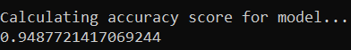

# Disaster Response Pipeline Project

## Project Overview
This project is meant to implement a complete machine learning pipeline to demonstrate Data Engineering skills which is part of Udacity Data Scientist Nanodegree.

In this project, real disaster data from [Figure Eight](https://www.figure-eight.com/) is analyzed to build a model for an API that classifies disaster messages.\
The used dataset contains real messages that were sent during disaster events.\
A machine learning pipeline is implemented to categorize these messages so that later on every message can be sent to an appropriate disaster relief agency.

The project includes a web app where an emergency worker can input a new message and get classification results in several categories.

## Let's see it working
- To run the web app and try out the model prediction\
    - Run the following command in the 'app' directory
        `python run.py`
    - Then Go to http://localhost:3001/

- To try out the ETL or ML pipelines, run the following commands in the project's root directory.
    - To run ETL pipeline that cleans data and stores it in database
        `python data/process_data.py data/disaster_messages.csv data/disaster_categories.csv data/disaster_messages.db`
    - To run ML pipeline that trains classifier and saves it
        `python models/train_classifier.py data/disaster_messages.db models/classifier.pkl`

## Project Components
1. ETL (Extract, Transform and Load) Pipeline.\
   Pipline is implemented in `data/process_data.py` script, where it:
    - Merges `data/disaster_messages.csv` and `data/disaster_categories.csv` datasets.
    - Extract categories and transform them to binary values.
    - Cleans data and removes duplicates.
    - Load cleaned data into SQLite database `data/disaster_messages.db`.
2. ML (Machine Learning) Pipeline.\
   Pipline is implemented in `models/train_classifier.py` script, where it:
    - Loads data from the SQLite database - resulted from ETL pipeline - into feature & target values.
    - Splits the dataset into training and test sets.
    - Builds a text processing and machine learning pipeline that performs multi-output classification\ 
      on the 36 categories in the dataset.
    - Trains and tunes the model using GridSearchCV.
    - Evaluates the resulted model by running prediction on the test set and display a classification report.
    - Exports the final model's best estimator as a pickle file `models/classifier.pkl`.
3. Flask Web App.\
   The app implementaion exists inside `app` directory.
    - App layout is implemented in `app/templates`.
    - App logic is implemnted in `app/run.py`, where it:
        - Uses plotly to compose a couple of graphs that helps explore the dataset.
        - Loads the saved model from the pkl file and uses it to predict the categories of the message entered via the app.

## The Model Performance
Here is the classification report on the final model.

And the accuracy score.

I had to use a really low number of estimators of the `RandomForestClassifier` to reduce the file size of the final model so that Github let me upload it to the repo :) 

Locally I trained the model setting `n_estimators` to 200, and results were greatly improved.

Here is the classification report on the final model.

And the accuracy score.

   

